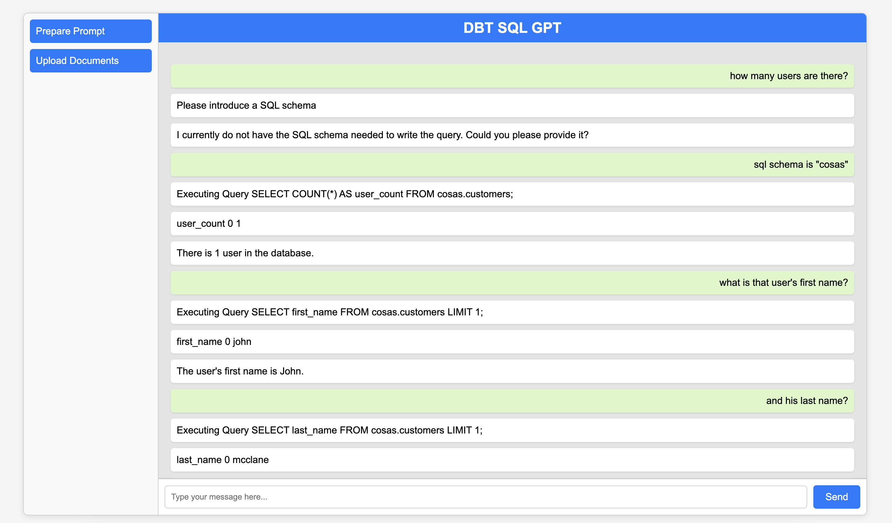

The main project here is to use DBT models to drive the correct execution of an Analysis specific SQL LLM to BigQuery 


```bash
cd dbt_sql_gpt
```

You need a `.env` file in that directory with the content:


```bash
OPENAI_API_KEY=xxxxx
GCP_PROJECT=xxxx
```

You also need to be authenticated with `gcloud` to your project and have the permissions to run the queries in your BigQuery.

```bash
gcloud config set project xxxx
gcloud auth application-default login
```

Then

```bash
poetry install
python app.py 
```

